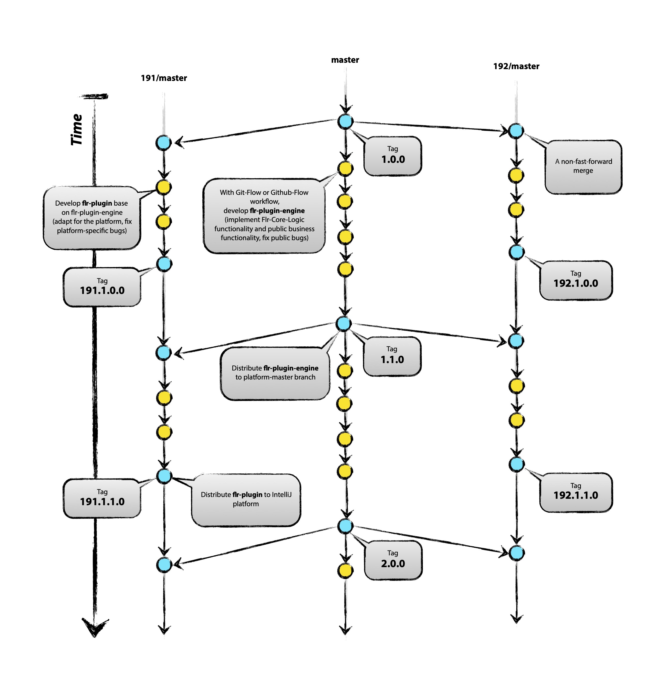

# Flr Plugin Workflow

由于`flr-plugin`依赖了[flutter插件](https://plugins.jetbrains.com/plugin/9212-flutter)和[dart插件](https://plugins.jetbrains.com/plugin/6351-dart)，`flr-plugin`需要为`Android Studio`的不同版本做适配和生产发布。

为了保证`flr-plugin`的具备良好的生产流程，所以为其定制了一个工作流，以指导如何对仓库分支进行管理以及如何发布生产版本。

> 关于插件与IntelliJ平台产品的兼容性的更多细节，可参考[《Plugin Compatibility with IntelliJ Platform Products》](https://www.jetbrains.org/intellij/sdk/docs/basics/getting_started/plugin_compatibility.html)。

## 工作流

生产`flr-plugin`的工作流整体如下：



下面将会做进一步详细介绍。

#### 主分支类型

代码仓库中主要有2种主分支类型：

- `master`分支

   - `master`分支在仓库创建之初就创建，其生命周期是无限的。
   - `master`分支主要用于`flr-plugin-engine`（Flr插件引擎）开发和发布；`flr-plugin-engine`的开发内容包括：实现`Flr-Core-Logic`（Flr核心逻辑）和其他与平台无关的功能，以及修复与平台无关的bug。

- `platform-master`分支

   - `platform-master`分支在`flr-plugin`需要为`新版本的Android Studio`进行新版本开发时创建，其生命周期也是无限的。

      `新版本的Android Studio`的定义是：`Android Studio`升级了`IntelliJ IDEA Community Edition`内核版本。

      > `Android Studio`是基于`IntelliJ IDEA Community Edition`构建开发的。

   - `platform-master`分支主要用于`flr-plugin`（Flr插件产品）开发和发布；`flr-plugin`的开发内容包括：基于`flr-plugin-engine`进行平台适配和修复与平台相关的bug。

   - `platform-master`分支的命名规则是：`#{IC_branch_number}/master`。其中`#{IC_branch_number}`为当前的`Android Studio`的`IntelliJ IDEA Community Edition`内核版本对应的分支号。

      **Q：** 如何获取`#{IC_branch_number}`？

      **A：** 从`Android Studio`的版本信息获取。比如，`Android Studio v3.6`的版本信息是：

      ```
      Android Studio 3.6
      Build #AI-192.7142.36.36.6200805, built on February 12, 2020
      ```

      其中`#AI-`后跟随的第一个数字`192`就是`#{IC_branch_number}`。

      所以，为`Android Studio v3.6`创建的`platform-master`的分支名为：`192/master`。

      > 关于`branch_number`的更多细节，可参考[《Build Number Ranges》](https://www.jetbrains.org/intellij/sdk/docs/basics/getting_started/build_number_ranges.html)。

#### 版本开发、管理和发布流程

当需要开发新版本时（功能升级或者兼容新版`Android Studio`），按照以下工作流进行代码开发提交和进行版本命名管理：

- 使用[Git-Flow](https://nvie.com/posts/a-successful-git-branching-model/)或者[Github-Flow](https://guides.github.com/introduction/flow/)的工作流，在`master`分支上进行需求开发。完成需求开发后，打tag发布新版本的`flr-plugin-engine`给`platform-master`使用；`flr-plugin-engine`的版本号（`plugin_engine_version`）的命名遵守[语义化版本semver 2.0](http://semver.org/)规范；
- 使用`non-fast-forward`的方式合并`master`分支新发布的`flr-plugin-engine`到各个`platform-master`分支；
- 在各个`platform-master`分支上，进行平台适配开发。完成适配开发后，打tag发布`flr-plugin`；
- 各个`platform-master`分支发布的`flr-plugin`的版本号（`plugin_product_version`）的命名规则是：`#{IC_branch_number}.#{plugin_engine_version}`，如当前最新发布的`flr-plugin-engine`的版本号为：`1.1.0`，在`192/master`分支发布的`flr-plugin`的版本号为：`192.1.1.0`。

